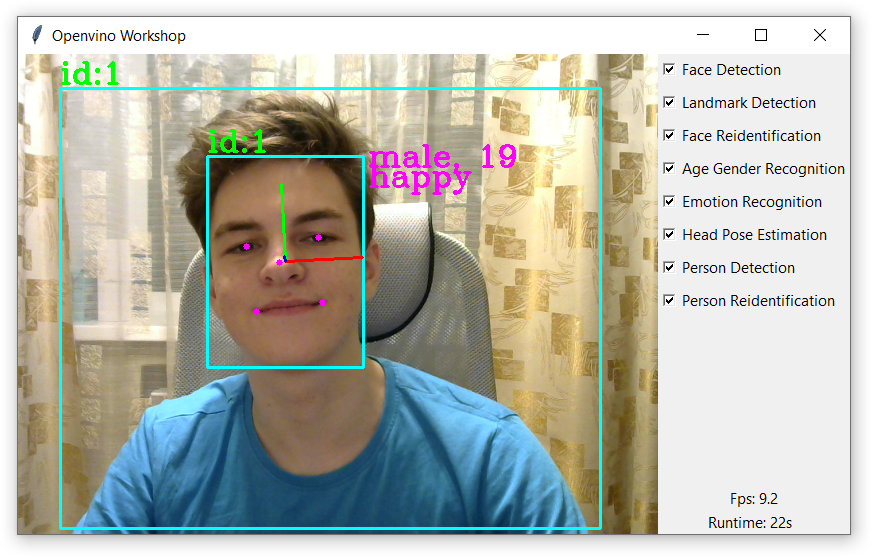
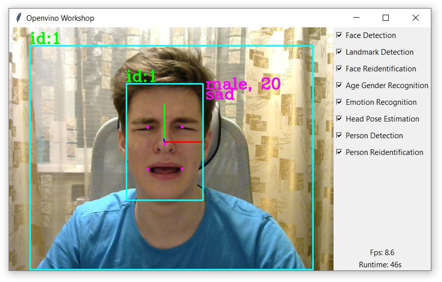
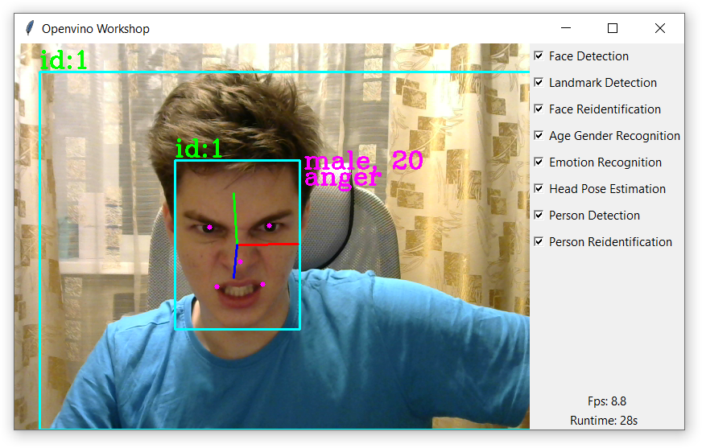
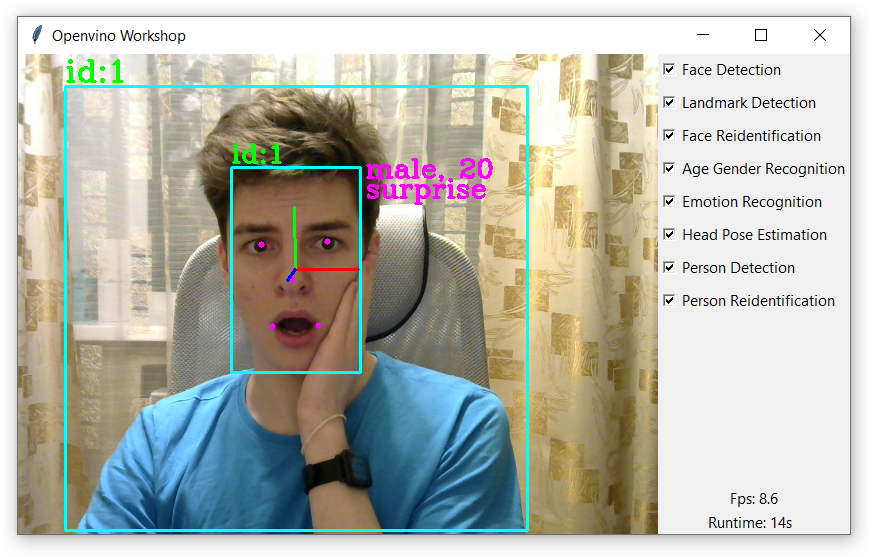

# openvino-workshop-public
Video processing powered by openvino

I was asked not to post the code yet.  
Here's a [video](https://yadi.sk/i/GAn8T670L7xgaA) of how the program works.

## It's me
<table>
    <tr>
        <td></td>
        <td></td>
    </tr>
    <tr>
        <td></td>
        <td></td>
    </tr>
</table>